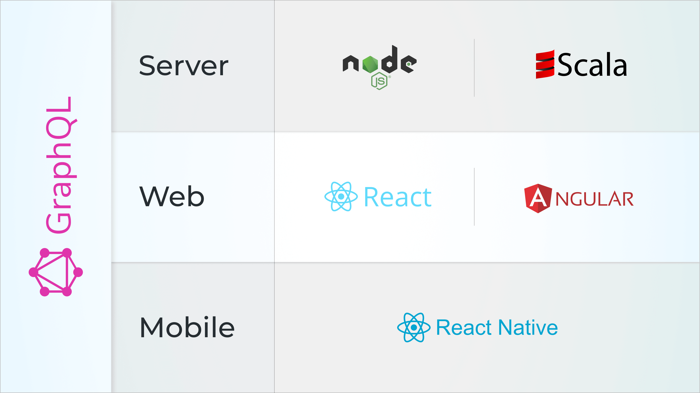

# Nodejs Starter Kit

## Official Website

You can test the deployment [demo application](https://mapp.mithileshkohale.com).

## Description



Nodejs Starter Kit is an SEO-friendly, fully configured, modular starter project for developing [Universal JavaScript] applications. You can use this kit to create your applications in JavaScript or TypeScript for all major platforms &ndash; mobile, web, and server.

Nodejs Starter Kit is built with [Apollo], [GraphQL], [React], [Angular], [React Native], [Expo], [Knex.js],
and [Express] with support for relational databases such as PostgreSQL, MySQL, and SQLite.

[TypeScript] is our language of choice and we use it across the entire project. However, you can freely mix vanilla JavaScript (the ES6 and ES7 syntax) and TypeScript when creating your modules.

The starter kit also integrates [Twitter Bootstrap], [Ant Design], and [NativeBase]
to provide great possibilities for styling for your web and mobile applications.

## Table of Contents

- [Overview](#overview)
  - [Why Use Nodejs Starter Kit](#why-use-nodejs-starter-kit)
  - [Concept](#concept)
  - [Architecture and Implemented Modules](#architecture-and-implemented-modules)
- [Branches](#branches)
- [First Run of Nodejs Starter Kit](#first-run-of-nodejs-starter-kit)
- [Project Structure](#project-structure)
- [Nodejs Starter Kit Documentation](#nodejs-starter-kit-documentation)
- [Support](#support)
  - [Community Support](#community-support)

## Overview

### Why Use Nodejs Starter Kit

#### I am a Developer

- Great productivity thanks to live reload and (partial) hot code reload
- Fractal modular architecture that's easy to support and extend
- The possibility to create modules in TypeScript _and_ JavaScript at the same time
- No need to develop [typical features](#architecture-and-implemented-modules) for your applications

#### I am a Project Manager

- Your application will work faster thanks to GraphQL
- Your team will be able to reuse the code for all the platforms
- Your team can create client, server, and mobile JavaScript applications
- Your application will be easier to support and evolve thanks to the fractal modular architecture
- Your application will be based on a widely-used JavaScript ecosystem (it's easy to find JS developers)
- Your team can develop new features straightaway instead of creating the basic features
- Your application will be integrated with Stripe, one of the top payment processors

### Concept

Developing client-server-mobile projects in JavaScript never was a trivial task. Not only do you have to spend time
installing the application dependencies and configuring them, but you're also constrained to implement many basic
functionalities over and over again. And you never have time to develop a starter codebase that you can reuse across
all of your projects.

To relieve you from the burden of configuring the project, developing the application structure, and implementing
typical features, we created Nodejs Starter Kit.

Nodejs Starter Kit provides you with a client-server-mobile application that you can employ as a foundation
for developing new web or mobile projects using popular tools from the JavaScript ecosystem. But our starter kit does so
much more than just creating a mix of popular JS technologies &mdash; it's powered by a few **custom** libraries and
solutions to simplify managing project configurations, creating new modules, building GraphQL queries, and perform many
other tasks.

The starter kit also consists of many modules that you can augment and adapt to develop your specific application. Also,
you can use those prebuilt modules as a reference when implementing basic features for your applications even if you
create them using other technologies.

### Architecture and Implemented Modules

Among all the approaches to building the application architecture, we opt for the _disposable fractal-based modular
architecture_. Thanks to it, it's possible to remove any built-in module from Nodejs Starter Kit without
breaking the application. We recommend that you develop your custom modules with the same idea in mind when using our
starter kit.

Nodejs Starter Kit comes with the following modules:

- **Authentication**. Authentication via social networks (Facebook, GitHub, LinkedIn, and Google using OAuth) and
  password-based authentication; refreshing a forgotten password
- **Authorization**. Permission-based authorization with various user roles
- **Contact Us Form**. Functionality to send messages to the server
- **Internationalization**. A complete internationalization solution for the client and server
- **Mobile Chat**. A live chat based on the [React Native Gifted Chat] and powered by GraphQL subscriptions
- **Pagination**. Navigation between pages and presentation of entities
- **Payments**. Functionality for recurring payments based on Stripe
- **Posts and Comments**. Functionality to add, delete, and update posts and comments
- **State Management**. The application state stored in the database and on the client using different approaches
- **404 Not Found Page**. A minimalistic module for handling 404 requests

If you don't want to use the pre-built modules in your project, you can remove them using a [dedicated CLI]. For module
names, see the names of directories under `modules`.

To learn more about the features and modules available in Nodejs Starter Kit, follow to the dedicated section
[Features and Modules].

<!--
## Demo

Here's a demo of Nodejs Starter Kit in action:


You can try out the latest version of Nodejs Starter Kit [deployed on Heroku]. If you want to see the mobile
React Native application in action, check out [this demo on Expo.io]. -->

## Branches

| Branch   | Description                                                         |
| -------- | ------------------------------------------------------------------- |
| [master] | The kit version with the latest features. May not work consistently |

## First Run of Nodejs Starter Kit

Verify if you use Node.js 6.x or higher (Node.js ^10 is recommended) before running the starter kit.

1. Clone the stable branch of Nodejs Starter Kit.

```
git clone -b master https://github.com/beingtmk/nodejs-starter-kit.git
cd nodejs-starter-kit
```

**NOTE**: If you're going to use Windows to develop with Nodejs Starter Kit, you need to additionally enable
symlinks _before_ you run the project.

For Windows 10:

- Press `Win` + `I` to open **Settings**
- Click **Update & Security**
- Click the **For Developers** tab
- In the **Use developer features** window, switch to **Developer Mode**

If you don't need the ready-made modules, you can also remove them using the [custom CLI].

2. Install the dependencies. Make sure that you use Yarn 1.0.0 or higher.

```
yarn
```

You can use NPM instead of Yarn to handle the starter kit dependencies and to run scripts. Throughout the Apollo
Universal Starter Kit documentation, we'll always use Yarn.

3. Seed sample data to the database. The command below will create new tables with sample data in SQLite:

```
yarn seed
```

SQLite is a typical default relational database installed in most Linux distributions including Mac OS X; otherwise,
consult [SQLite installation guide].

4. Run the starter kit in development mode:

```
yarn watch
```

The server application will be running on [http://localhost:3000], while the client application will be running on
[http://localhost:8080]. The terminal will tell your the exact ports.

For more information about running this starter kit for mobile development or Docker, consult the [Getting Started]
guide.

## Project Structure

The project structure presents generally accepted guidelines and patterns for building scalable web and mobile
applications.

The structure is _fractal_ meaning the available functionality is grouped primarily by feature rather than by file type.
But the current structure isn't prescriptive, and you can change it however you like.

```
nodejs-starter-kit
├── config                      # Various application configurations
├── docs                        # Documentation
├── node_modules                # Global Node.js modules
├── modules                     # All the prebuilt project modules
├── packages                    # Available packages
│   ├── client                  # React client
│   ├── client-angular          # Angular client
│   ├── client-vue              # Vue client
│   ├── common                  # Common code
│   ├── mobile                  # React Native mobile client
│   ├── server                  # Node.js and Express server
│   └── server-scala            # Scala server
└── tools                       # All build and CLI-related files
```

Inside `modules`, you'll find all the prebuilt modules that Nodejs Starter Kit comes with. Each module under
`modules` contains sub-directories with module implementations for different technologies. For example, if you look up
the module `modules/core`, you'll see the following sub-modules:

```
nodejs-starter-kit
├── modules                       # Available packages
│   ├── core                      # The core module
│       ├── client-angular        # Core functionality for Angular app
│       ├── client-react          # Core functionality for React app
│       ├── client-react-native   # Core functionality for React Native app
│       ├── client-vue            # Core functionality for Vue app
│       ├── common                # React Native mobile client
│       ├── server-scala          # Core functionality for Scala server
│       └── server-ts             # Core functionality for Express server
└── tools                         # All build and CLI-related files
```

## Nodejs Starter Kit Documentation

Follow to the documentation concerning different aspects of how to run, configure, and develop with Nodejs
Starter Kit.

- [Getting Started]
  - [Installing and Running Nodejs Starter Kit]
  - [Running the Mobile App with Expo]
  - [Running the Starter Kit in a Mobile Simulator]
- [Running Nodejs Starter Kit with Docker]
- [Deploying Nodejs Starter Kit to Production]
- [Configuring Nodejs Starter Kit]
- [Features and Modules]
- [Writing Code]
- [Debugging Code]
- [Available Scripts]
- [Frequently Asked Questions]
- [Project Structure]
- [Importing Modules]
- [E-commerce Features]
  - [Adding/Removing features]

Tools

- [Nodejs Starter Kit CLI]

Modules

- [Stripe Payments]
- [Mobile Chat]

## Support

### Community Support

- [GitHub issues] &ndash; submit issues and send feature requests
- [Wiki] &ndash; read documentation for the usage scenarios of the starter kit; edit the documentation
- [FAQ] &ndash; consult the Frequently Asked Questions section

[mit]: LICENSE
[universal javascript]: https://medium.com/@mjackson/universal-javascript-4761051b7ae9
[apollo]: http://www.apollostack.com
[graphql]: http://graphql.org
[jwt]: https://jwt.io
[react]: https://reactjs.org/
[angular]: https://angular.io/
[react native]: https://facebook.github.io/react-native/
[expo]: https://expo.io/
[knex.js]: http://knexjs.org
[express]: http://expressjs.com
[typescript]: https://www.typescriptlang.org/
[twitter bootstrap]: http://getbootstrap.com
[ant design]: https://ant.design
[nativebase]: https://nativebase.io
[apollokit.org]: https://apollokit.org
[demo application]: https://nodejs-starterkit.approxyma.com/
[react native gifted chat]: https://github.com/FaridSafi/react-native-gifted-chat

<!-- [deployed on heroku]: https://nodejs-starter-kit.herokuapp.com -->

<!-- [this demo on expo.io]: https://expo.io/@sysgears/nodejs-starter-kit -->

[master]: https://github.com/sysgears/nodejs-starter-kit/tree/master
[sqlite installation guide]: http://www.sqlitetutorial.net/download-install-sqlite/
[http://localhost:3000]: http://localhost:3000
[http://localhost:8080]: http://localhost:8080
[getting started]: /docs/Getting%20Started.md
[installing and running nodejs starter kit]: /docs/Getting%20Started.md#installing-and-running-nodejs-starter-kit
[running the mobile app with expo]: /docs/Getting%20Started.md#running-the-mobile-app-with-expo
[running the starter kit in a mobile simulator]: /docs/Getting%20Started.md#running-the-starter-kit-in-a-mobile-simulator
[running nodejs starter kit with docker]: /docs/Docker.md
[deploying nodejs starter kit to production]: /docs/Deployment.md
[configuring nodejs starter kit]: /docs/Configuration.md
[dedicated cli]: /docs/tools/CLI.md#deleting-features-with-deletemodule
[respective cli section]: /docs/tools/CLI.md#selecting-the-technology-stack-with-choosestack
[features and modules]: /docs/Features%20and%20Modules.md
[writing code]: /docs/Writing%20Code.md
[debugging code]: /docs/Debugging.md
[nodejs starter kit cli]: /docs/tools/CLI.md
[available scripts]: /docs/Yarn%20Scripts.md
[stripe payments]: /docs/modules/Stripe%20Subscription.md
[mobile chat]: /docs/modules/Mobile%20Chat.md
[project structure]: /docs/Project%20Structure.md
[importing modules]: /docs/Importing%20Modules.md
[E-commerce Features]: /docs/Ecommerce%20Features/E-commerce%20Features.md
[Adding/Removing features]: /docs/Ecommerce%20Features/AddingOrRemoving%20features.md
[frequently asked questions]: /docs/FAQ.md
[sysgears (cyprus) limited]: http://sysgears.com
[gitter channel]: https://gitter.im/sysgears/apollo-fullstack-starter-kit
[github issues]: https://github.com/sysgears/nodejs-starter-kit/issues
[wiki]: https://github.com/sysgears/nodejs-starter-kit/wiki
[faq]: /docs/FAQ.md
